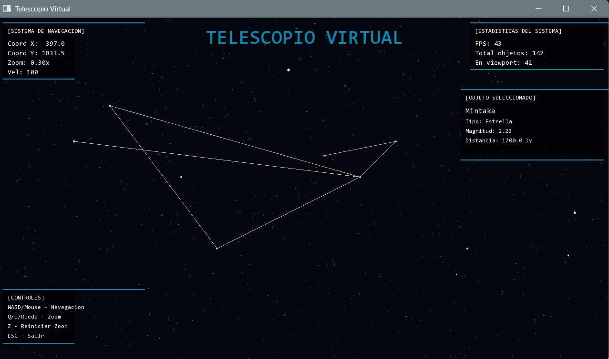

# 🌌 TELESCOPIO VIRTUAL NASA

Simulador de telescopio espacial de grado profesional desarrollado en C++ con SFML, implementando estructuras de datos avanzadas para gestión eficiente de objetos astronómicos.



---

## **Descripción**

Sistema de exploración espacial interactivo que permite navegar por el universo, visualizar estrellas reales con datos científicos, identificar constelaciones y obtener información detallada de objetos celestes mediante una interfaz inspirada en sistemas de control de la NASA.

---

## **Características Principales**

### **Navegación Espacial**
- Movimiento fluido con WASD o mouse en bordes de pantalla
- Zoom dinámico con Q/E/Z o rueda del mouse
- Universo de 12,000×12,000 unidades
- Coordenadas en tiempo real

### **Objetos Astronómicos**
- 125+ objetos organizados eficientemente
- 50+ estrellas con nombres reales (Sirius, Betelgeuse, Polaris, etc.)
- Datos científicos: magnitud, tipo espectral, distancia
- Colores realistas según temperatura estelar

### **Constelaciones**
- 4 constelaciones implementadas: Osa Mayor, Osa Menor, Casiopea, Orión
- Líneas conectoras en colores pastel únicos
- Identificación visual clara

### **Sistema de Interacción**
- Click izquierdo: Seleccionar objeto y ver información
- Click derecho: Deseleccionar
- Panel de información con datos científicos

### **Interfaz**
- Paneles
- Fondos semi-transparentes
- HUD con estadísticas en tiempo real (FPS, coordenadas, zoom, objetos visibles)

---

## **Estructuras de Datos Implementadas**

### **1. Diccionario (unordered_map)** 
**Archivo:** `CatalogoEstelar.h/.cpp`

**Propósito:** Almacenamiento y búsqueda de objetos por nombre

**Complejidad:**
- Inserción: O(1)
- Búsqueda: O(1)
- Eliminación: O(1)

**Implementación:** Tabla hash que mapea nombres de estrellas a objetos astronómicos completos.

**Ventaja:** Búsqueda instantánea independiente del tamaño del catálogo.

---

### **2. Árbol de Segmentos Espacial (QuadTree)**
**Archivo:** `QuadTree.h/.cpp`

**Propósito:** Optimización de búsquedas espaciales por región

**Complejidad:**
- Inserción: O(log n)
- Búsqueda por región: O(log n)

**Implementación:** Árbol que divide recursivamente el espacio en 4 cuadrantes. Cada nodo puede contener máximo 4 objetos antes de subdividirse.

**Ventaja:** Reduce búsquedas de O(n) a O(log n). Solo procesa objetos en regiones visibles.

**Estadísticas del proyecto:**
- 125 objetos organizados
- 4 niveles de profundidad
- Capacidad: 4 objetos por nodo

---

### **3. Matriz Dispersa (Sparse Matrix)**
**Archivo:** `MatrizDispersa.h/.cpp`

**Propósito:** Organización eficiente del espacio minimizando uso de memoria

**Complejidad:**
- Acceso: O(1) promedio
- Inserción: O(log n)

**Implementación:** `map<pair<int,int>, Celda>` que solo almacena celdas ocupadas.

**Ventaja:** Ahorro masivo de memoria en espacios mayormente vacíos.

**Estadísticas del proyecto:**
- Dimensiones virtuales: 200×200 = 40,000 celdas
- Celdas ocupadas: 125
- Eficiencia: alrededor de 99% de ahorro de memoria

---

## **Tecnologías Utilizadas**

- **Lenguaje:** C++17
- **Librería Gráfica:** SFML 3.0
- **Compilador:** MinGW g++ 13.1.0
- **Estructuras:** STL (map, unordered_map, vector)

---

## **Estructura del Proyecto**

```
TELESCOPIO VIRTUAL/
├── bin/                    # Ejecutable y DLLs
├── src/                    # Código fuente (.cpp)
│   ├── main.cpp
│   ├── Camera.cpp
│   ├── ObjetoAstronomico.cpp
│   ├── CatalogoEstelar.cpp
│   ├── QuadTree.cpp
│   ├── MatrizDispersa.cpp
│   ├── HUD.cpp
│   └── Constelacion.cpp
├── include/                # Headers (.h)
│   ├── Camera.h
│   ├── ObjetoAstronomico.h
│   ├── CatalogoEstelar.h
│   ├── QuadTree.h
│   ├── MatrizDispersa.h
│   ├── HUD.h
│   └── Constelacion.h
├── assets/                 # Recursos
│   └── fonts/
├── build.bat              # Script de compilación
└── README.md
```

---

## **Compilación y Ejecución**

### **Requisitos Previos**
- MinGW con g++ instalado
- SFML 3.0 para MinGW en `C:\SFML-3.0.2\`
- DLLs de SFML en la carpeta `bin/`

### **Compilar**
```bash
# Ejecutar script de compilación
build.bat
```

### **Ejecutar**
```bash
cd bin
telescopio.exe
```

---

## **Controles**

| Acción | Control |
|--------|---------|
| Mover cámara | WASD o Mouse en bordes |
| Zoom In | E o Rueda arriba |
| Zoom Out | Q o Rueda abajo |
| Reset Zoom | Z |
| Seleccionar objeto | Click izquierdo |
| Deseleccionar | Click derecho |
| Salir | ESC |

---

## **Rendimiento**

- **FPS:** 60 constantes
- **Objetos renderizados:** Solo los visibles (optimización QuadTree)
- **Memoria:** Optimizada con matriz dispersa
- **Búsquedas:** O(1) por nombre, O(log n) por región

---

## **Autores**

**Andrea Alejandra Suárez Cuervo**
**Manuel Arturo Fajardo Contreras**

**Materia:** Estructuras de Datos  
**Institución:** Universidad Nacional de Colombia  
**Fecha:** Noviembre 2024

---

## **Referencias**

- Catálogo estelar: Datos de estrellas reales
- Algoritmos de QuadTree para optimización espacial
- Matrices dispersas para eficiencia de memoria

---

## **Demostración**

El proyecto demuestra aplicación práctica de estructuras de datos en software científico real, replicando técnicas usadas en observatorios y simuladores espaciales profesionales.
